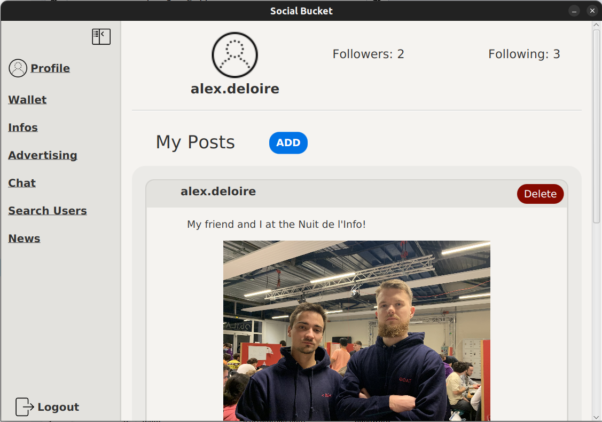
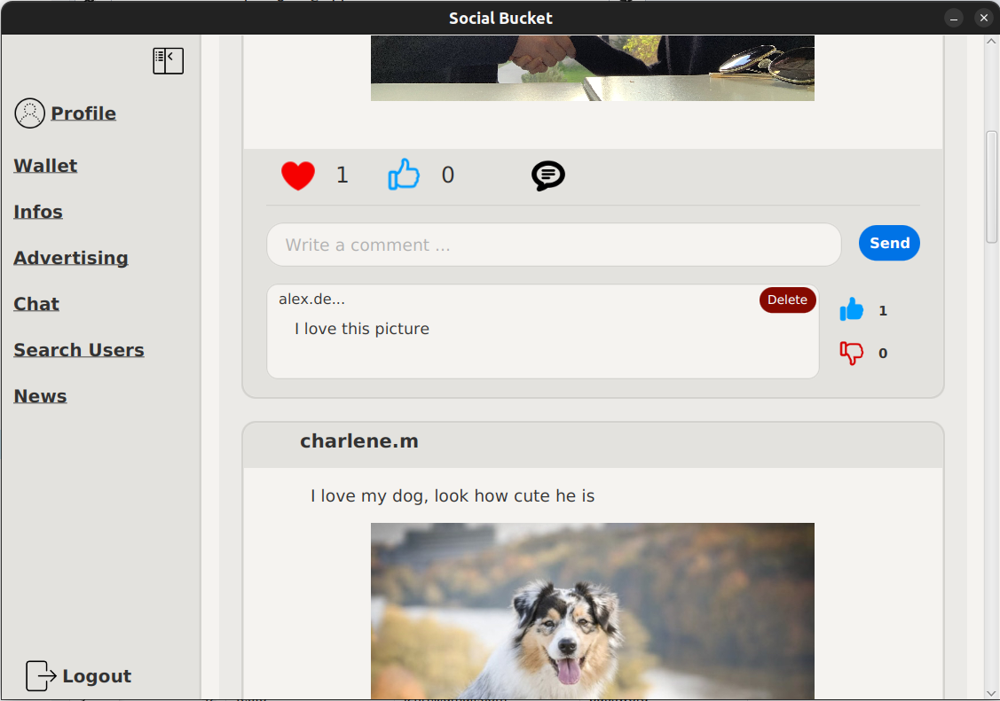

<div align="center">

# Social Bucket, the future of social media

<a rel="license" href="http://creativecommons.org/licenses/by-nc-sa/4.0/"></a><br />This work is licensed under a <a rel="license" href="http://creativecommons.org/licenses/by-nc-sa/4.0/">Creative Commons Attribution-NonCommercial-ShareAlike 4.0 International License</a>.

---

### **Description**

Social Bucket is a social media application that allows users to share their thoughts and ideas with the world. You can upload images, text or even files! You can also follow your friends and see what they are up to and if you like their content, you can give them a like and even comment on their posts. You can also chat with them with our global chat feature. Social Bucket lets you load up a wallet with money so that you can pay for our custom ad service or even pay in shops that accept Social Bucket payments.

---

[Installation and Execution](#installation) •
[Documentation](#documentation) •
[Contributions](#contributions)

</div>


## Features

- **Content Sharing:** Users can share thoughts, ideas, images, text, and files with the global community.
- **Follow Friends:** Users can search and follow their friends and stay updated on their activities and posts.
- **Engagement Tools:** Users can like and comment on posts shared by others.
- **Global Chat:** A feature allowing users to engage in conversations with friends and other users globally.
- **Wallet Integration:** Users can load money into their wallet within the app.
- **Custom Ad Service:** Users can pay for a custom ad service within the app to promote their content.
- **Payment Functionality:** Users can make payments in shops that accept Social Bucket payments, utilizing the money in their wallet.


## Table of Contents

- [Installation](#installation)
  - [Pre-requisites](#pre-requisites)
  - [Testing](#testing)
  - [Run](#Run)
  - [Demo Screenshots](#demo-screenshots)
  - [Chat Server](#chat-server)
- [Documentation](#documentation)
  - [Generate javadoc](#generate-javadoc)
- [Contributions](#contributions)
  - [Authors](#authors)
  - [Version control](#version-control)

# Installation
<sup>[(Back to top)](#table-of-contents)</sup>

## Pre-requisites
<sup>[(Back to top)](#table-of-contents)</sup>

This app works with:

- Java 11 (any version above 11 should work)
- Apache Maven 3.6.3

to install maven on ubuntu:
```bash
sudo apt install maven
```

## Testing
<sup>[(Back to top)](#table-of-contents)</sup>

To run the tests, run the following command in the root directory of the project:
```bash
mvn clean test
```

## Run
<sup>[(Back to top)](#table-of-contents)</sup>

The database is deployed on Render and the application show automatically connect to it.

If you wish to use a local database, don't forget to change the database configs and run the ```SocialBucket.sql``` script.

To run the application, run the following command in the root directory of the project:
```bash
mvn clean test javafx:run
```

## Demo Screenshots
<sup>[(Back to top)](#table-of-contents)</sup>

Some screenshots of the application:

Profile page:



News Feed:



## Chat Server
<sup>[(Back to top)](#table-of-contents)</sup>

Right now, the chat server runs itself, this is the development mode. In production, the chat server will be deployed on a separate server. If you want to run the server locally, you can do so by removing the "Just for development" lines of code and running the server yourself.

# Documentation
<sup>[(Back to top)](#table-of-contents)</sup>

Thourough documentation and diagrams are provided in the ```docs``` folder:

```bash
.
├── diagrams
│   ├── AdManagementDiagrams.pdf
│   ├── ChatDiagrams.pdf
│   ├── CommentManagementDiagrams.pdf
│   ├── PostManagementDiagrams.pdf
│   ├── ProfileManagementDiagrams.pdf
│   ├── UserManagementDiagrams.pdf
│   └── WalletManagementDiagrams.pdf
├── domain_model
│   └── DomainModel.pdf
├── javadoc
│   └── apidocs
└── use_cases
    └── UseCases.pdf
```

## Generate javadoc
<sup>[(Back to top)](#table-of-contents)</sup>

To generate the javadoc, run the following command in the root directory of the project:
```bash
mvn javadoc:javadoc
```

# Contributions
<sup>[(Back to top)](#table-of-contents)</sup>

## Authors
<sup>[(Back to top)](#table-of-contents)</sup>

- [**Alexandre Deloire**](https://github.com/alexdeloire)
- [**Remi Jorge**](https://github.com/RemiJorge)
- [**Jiayi He**](https://github.com/JiayiHE95)
- [**Charlene Morchipont**](https://github.com/charleneMrcp)

## Version control
<sup>[(Back to top)](#table-of-contents)</sup>

Git is used for version control. The project was done in sprint iterations, with a new version of the project being released at the end of each sprint.
